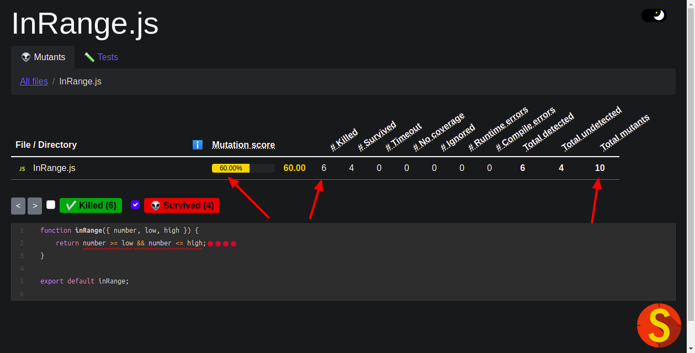

# Mutation Tests
Example of how to use mutation tests in your code. 

Once you write your code (backend or frontend) you have to assure the minimum bugs possible. That's why we write unit tests for both backend and frontend code. However, how can we tell that the tests we wrote are enough? We might miss one or two (maybe more...) test cases. Don't worry, we got **mutant tests** to help us out with this questions!

In a nutshell, mutant testing is the insertion of changes (or mutants) in our code in order to test the unit tests we wrote. That's right, we are going to test the tests! If our tests covers all the cases (i. e. kill all the mutants), then we're good to go. However, if some mutants remain alive it means we need to write more tests. 

There are some tools we can work with for both backend and frontend develepment.

# Backend 
For backend development, we can use [pitest](https://pitest.org/). A deep explanation of how this plugin works can be found [here](https://dev.to/gabrielaugusto1996/testes-de-mutacao-garanta-ja-a-qualidade-do-seu-codigo-16gn).

Once you have your maven project (this can be achieved with gradle as well), you just need to run the following maven command and the report will be shown in the log of your terminal:

    $ mvn org.pitest:pitest-maven:mutationCoverage

# Frontend
For frontend development, we can use [stryker](https://stryker-mutator.io/). A deep explanation of how this plugin works can be found at the [documentation](https://stryker-mutator.io/docs/stryker-js/introduction/).

First of all let's create our new project with:

    $ npx create-react-app mutation
    $ npm start

After, we can install stryker with:

    $ npm install --save-dev @stryker-mutator/core
    $ npx stryker init
    
After we write our code and our units test, we are able to run the mutant analysis
    # Only for small projects:
    $ npx stryker run

# Results

You may notice the report of mutation tests appear in the logs provided at the terminal. However, you may also open in your favorite browser the same report generated at the folders: 

    target/pit-reports/index.html (backend)
    
    mutation/reports/mutation/mutation.html (frontend)

At first you might not have coveraged all the tests you needed. Therefore, the report generated may look like this:

You can click on the red dots to understand the tests that you missed to write. Once you wrote all the tests required, your report should look like this:

# References
Multi-Module Project with Maven, by Denis Szczukocki. Baeldung. Access in 2022, https://www.baeldung.com/maven-multi-module

99 - Teste de Mutação | Uma ideia louca que funciona! 🤪, by Otavio Lemos. Youtube, canal: [Otavio Lemos](https://www.youtube.com/@otaviolemos). Access in 2022, https://www.youtube.com/watch?v=zXM3TpHaaUk
